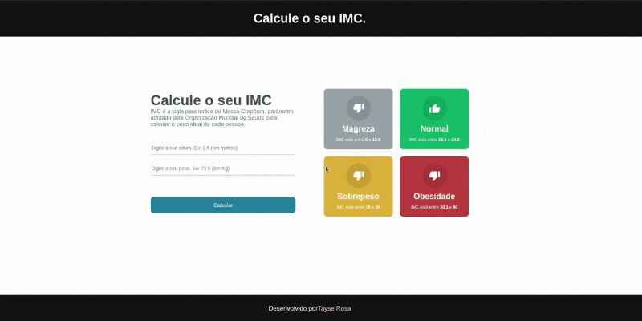

<h2 align="center" target="_blank">
   
</h2>


<h1 align="center"> Aplicação que calcula o IMC (Índice de Massa Corpórea)</h1>


<p align="center">
  
</p>

---
# 🛠 Sobre o projeto

<p>
Esta aplicação calcula o IMC (Índice de Massa Corpórea) foi desenvolvida em React JS para consolidar os conhecimentos de React JS adiquiridos, e para contribuir com a comunidade dev.
</p>

---

# 🚀 Tecnologias utilizadas neste projeto
O projeto foi desenvolvido utilizando as seguintes tecnologias:

- [x] JAVASCRIPT
- [x] REACT JS
- [x] TYPESCRIPT
- [x] CSS MODULES

# 📥 Como usar
```js

    //Clonar o repositório
    $ git clone https://github.com/TayseRosa/imc_reactjs.git

    //Entrar no diretório
    $ cd imc_reactjs

    //Instalar bibliotecas
    $ npm install

    //Startar projeto
    $ npm start

``` 

# 🚀 Autor

<a href="https://www.tayserosa.dev">
 
 <br />
 <sub><b>www.tayserosa.dev</b></sub></a> <a href="https://www.tayserosa.dev" title="Tayse Rosa">🚀</a>


Feito com ❤️ por Tayse Rosa 🚀


Portfólio: https://www.tayserosa.dev

LinkedIn: https://www.linkedin.com/in/tayse-rosa-3b683151/
